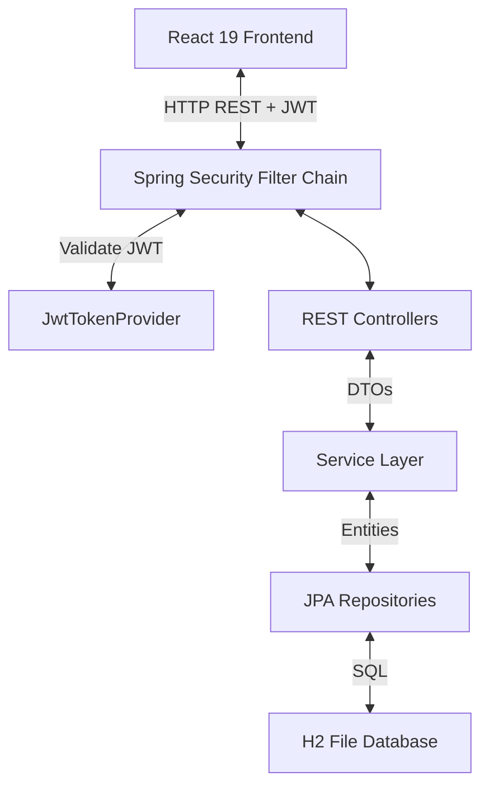

# Modern Full-Stack To-Do Management System

A production-ready task management application built using a Spring Boot backend, a React frontend, and an H2 file database. Designed using clean architecture, SOLID principles, and best-in-class UI aesthetics (featuring dynamic dark mode).

---

## Features

- **Authentication**: JWT-based session security with stateless Access Tokens and database-backed rotating Refresh Tokens.
- **Task Management**: Full CRUD operations including search, paging, filtering (by status, priority, due date), and custom sorting.
- **Aesthetic Dashboard**: Aggregates task completion metrics, displays progression bars, and showcases recent tasks.
- **User Profile**: Inline profile modifications including username, email, and password changes.
- **Premium Interface**: Built with Material UI, responsive layouts, subtle animations, and automatic dark/light theme switching.
- **Sample Data**: Automatically seeds dummy users and tasks on startup.

---

## Tech Stack

### Frontend
- **React 19**
- **Vite** (Build Tool)
- **React Router v6** (Routing)
- **Redux Toolkit** (Global State Management)
- **Axios** (Centralized client with token inject + auto-refresh interceptors)
- **Material UI v6** (Component Library)

### Backend
- **Java 21**
- **Spring Boot 3.x**
- **Spring Security** (Authentication Filter Chain)
- **Spring Data JPA & Hibernate** (Data layer)
- **H2 File Database** (Persistent storage)
- **JUnit 5 & Mockito** (Unit & Integration tests)
- **Springdoc OpenAPI / Swagger** (Interactive API Docs)

---

## Architecture Overview



---

## Local Setup Instructions

### Prerequisites
- **Java Development Kit (JDK) 21**
- **Node.js** (v18 or higher)
- **Maven** (optional, wrapper is not included but mvn command works)

### 1. Run Backend
1. Navigate to the backend directory:
   ```bash
   cd backend
   ```
2. Build and test the project:
   ```bash
   mvn clean test
   ```
3. Run the Spring Boot application:
   ```bash
   mvn spring-boot:run
   ```
   The server will start at `http://localhost:8080`.

### 2. Run Frontend
1. Navigate to the frontend directory:
   ```bash
   cd frontend
   ```
2. Install packages:
   ```bash
   npm install
   ```
3. Launch development server:
   ```bash
   npm run dev
   ```
   The React app will open at `http://localhost:5173`.

---

## Running with Docker Compose

To spin up the entire application (including database persistence) under a unified port:

1. In the project root directory, run:
   ```bash
   docker compose up --build
   ```
2. The React frontend will be accessible at `http://localhost`.
3. The API will be proxied through `http://localhost/api`.

---

## Sample Login Credentials

On application startup, two demo accounts are automatically registered:

| Role | Email | Password |
| :--- | :--- | :--- |
| **Regular User** | `user@example.com` | `User@123` |
| **Admin User** | `admin@example.com` | `Admin@123` |

---

## Database Console (H2 Console)

You can examine the database tables using the web console:
- **URL**: `http://localhost:8080/h2-console`
- **JDBC URL**: `jdbc:h2:file:./data/tododb`
- **Username**: `sa`
- **Password**: *(leave blank)*

---

## API Documentation (Swagger UI)

Interactive Swagger API specifications are available when the backend is running:
- **Swagger URL**: `http://localhost:8080/swagger-ui.html`
- **API Spec JSON**: `http://localhost:8080/api-docs`

### Major REST Endpoints

#### Authentication
- `POST /api/auth/register` - Registers a new user.
- `POST /api/auth/login` - Authenticates credentials and returns JWT + Refresh token.
- `POST /api/auth/refresh` - Requests a new access token using a valid refresh token.
- `POST /api/auth/logout` - Deletes refresh token session.

#### User Profile
- `GET /api/users/profile` - Fetches authenticated user info.
- `PUT /api/users/profile` - Updates username, email, and password.

#### Tasks CRUD
- `GET /api/tasks` - Lists tasks with support for search, status/priority/date filtering, sort, and paging.
- `GET /api/tasks/{id}` - Fetches detailed properties for a task.
- `POST /api/tasks` - Creates a new task.
- `PUT /api/tasks/{id}` - Updates a task's title, description, priority, and due date.
- `DELETE /api/tasks/{id}` - Deletes a task.
- `PATCH /api/tasks/{id}/status` - Sets a task status (`PENDING`, `IN_PROGRESS`, `COMPLETED`).

#### Dashboard
- `GET /api/dashboard/stats` - Returns overall counts, percentage completion, and top 5 recent tasks.
